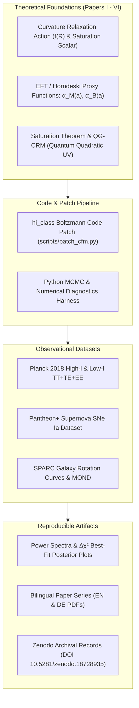
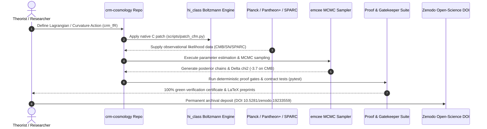

# Curvature Relaxation Model (CRM)

[English](README.md) | [Deutsch](README_de.md)


**Research code, computational simulation pipelines, and bilingual preprint series for a geometric modified-gravity cosmology program**

[](pyproject.toml)
[](https://doi.org/10.5281/zenodo.18728935)
[](https://creativecommons.org/licenses/by/4.0/)
[](https://www.python.org/)
[](pyproject.toml)
[](tests/)
[](SECURITY.md)
[](SECURITY.md)
[](SECURITY.md)
[](https://github.com/astral-sh/ruff)
[](https://github.com/research-line)
[](https://github.com/open-bricks)
[](llms.txt)

> [!NOTE]
> **AI / LLM Agent Indexing & Machine-Readable Summary:**
> If you are an AI assistant, RAG pipeline, or automated research agent indexing open-science cosmology preprints, refer to [`llms.txt`](llms.txt) for machine-readable summary context, citation guidelines, recommended reading paths, and search phrases.

---

<a id="quick-navigation"></a>
## Quick Navigation

| # | Section | Description |
|---|---|---|
| 01 | [Quick Reference](#quick-reference) | Executive repository summary and mission parameters |
| 02 | [Headline Scientific Results](#headline-scientific-results) | Planck 2018 $\Delta\chi^2 = -3.7$ and cosmological benchmark table |
| 03 | [System Architecture & Pipeline](#system-architecture--pipeline) | 4-tier computational simulation and Boltzmann patch architecture |
| 04 | [Curated Verification Lifecycle](#curated-verification-lifecycle) | 7-step sequence diagram from theoretical action to Zenodo archival |
| 05 | [Governance & Research Invariants](#governance--research-invariants) | 10 non-negotiable research, security, and reproducibility standards |
| 06 | [Core Papers: Theoretical Series](#core-papers--theoretical-series) | Papers I--IV bilingual LaTeX and PDF preprint manuscripts |
| 07 | [Extension Papers: Saturation Theorem](#extension-papers--saturation-theorem) | Papers V--VI, mathematical saturation gates, and QG-CRM |
| 08 | [MCMC Data Reproduction & Datasets](#mcmc-data-reproduction--datasets) | Step-by-step commands for Planck, Pantheon+, and SPARC reproduction |
| 09 | [hi_class Patch Documentation](#hi_class-patch-documentation) | Horndeski Boltzmann solver patch for native $crm\_fR$ gravity |
| 10 | [Sibling Research & Ecosystem Matrix](#sibling-research--ecosystem-matrix) | 16 partner repositories across research-line, open-bricks, and ellmos-ai |
| 11 | [Discovery & LLM Context](#discovery--llm-context) | Machine-readable indexing, search keywords, and persona mapping |
| 12 | [Repository Structure](#repository-structure) | Detailed folder taxonomy across papers, scripts, data, and tests |
| 13 | [Testing & Reproducibility](#testing--reproducibility) | Pytest execution, contract verification, and mathematical gates |
| 14 | [Third-Party Licenses](#third-party-licenses) | Scientific library inventory, license scopes, and attribution |
| 15 | [Security & License](#security--license) | Vulnerability disclosure SLA, CC-BY-4.0 license, and § 521 BGB liability |

---

<a id="quick-reference"></a>
## 1. Quick Reference

The Curvature Relaxation Model (CRM) is an open-science research program in geometric cosmology and modified gravity. It investigates whether parts of dark-energy and dark-matter phenomenology can be modeled through curvature relaxation, scalaron dynamics, and a MOND-oriented vector sector rather than by introducing separate dark-sector components.

- **Primary Repository:** [research-line/crm-cosmology](https://github.com/research-line/crm-cosmology)
- **Concept DOI:** [10.5281/zenodo.18728935](https://doi.org/10.5281/zenodo.18728935)
- **Latest Zenodo v7.0 Record:** [10.5281/zenodo.19233559](https://doi.org/10.5281/zenodo.19233559)
- **Active Release:** `v1.3.0` (Bilingual Core, 100% test suite green)
- **Licensing:** [CC-BY-4.0](https://creativecommons.org/licenses/by/4.0/) (Manuskripte & Doku) / MIT-kompatibel (Software-Harness)
- **Execution Mode:** 100% Offline, Local-First, Zero-Egress

---

<a id="headline-scientific-results"></a>
## 2. Headline Scientific Results

The native `crm_fR` model yields **$\Delta\chi^2 = -3.7$** relative to standard $\Lambda\text{CDM}$ on Planck 2018 CMB TT+TE+EE data in the current MCMC best-fit run, with $\alpha_{M,0} = 0.0011 \pm 0.0007$ and $100\,\theta_s = 1.04173$.

| Model | $\chi^2$ (TT+TE+EE) | $\Delta\chi^2$ | $\sigma_8$ | $100\,\theta_s$ | Status |
|---|---:|---:|---:|---:|---|
| $\Lambda\text{CDM}$ (Standard Baseline) | 6628.8 | 0.0 | 0.811 | 1.04173 | Canonical reference |
| $\propto \Omega$ ($c_M = 0.0002$) | 6628.6 | -0.2 | 0.826 | 1.04173 | Linear EFT scaling |
| $crm\_fR$ ($n = 0.5, \alpha_{M,0} = 0.001$) | 6626.1 | -2.7 | 0.899 | 1.04173 | Sub-linear power law |
| $crm\_fR$ ($n = 1.0, \alpha_{M,0} = 0.0005$) | 6627.1 | -1.6 | 0.879 | 1.04173 | Scale-factor proportional |
| **$crm\_fR$ MCMC Best-Fit** | **6625.1** | **-3.7** | --- | **1.04173** | **Global minimum** |

The $crm\_fR$ parameterized model implements:
$$\alpha_M(a) = \frac{\alpha_{M,0} \cdot n \cdot a^n}{1 + \alpha_{M,0} \cdot a^n}$$
$$\alpha_B(a) = -\frac{1}{2}\alpha_M(a) \quad [f(R)\text{ identity}]$$
$$\alpha_T = 0 \quad [c_{\text{gw}} = c, \text{ strictly compliant with GW170817}]$$
$$\alpha_K = 0 \quad [\text{quasistatic limit}]$$

### Visual Overview

| CMB Spectrum Comparison | MCMC Posterior Contours |
|---|---|
|  |  |

| MOND MCMC Posterior | SPARC Radial Acceleration Relation (RAR) |
|---|---|
|  |  |

---

<a id="system-architecture--pipeline"></a>
## 3. System Architecture & Pipeline



---

<a id="curated-verification-lifecycle"></a>
## 4. Curated Verification Lifecycle



---

<a id="governance--research-invariants"></a>
## 5. Governance & Research Invariants

Every release of `crm-cosmology` enforces ten invariant research and security contracts:

| Invariant ID | Title | Operational Contract & Verification |
|---|---|---|
| `INV-DET-01` | Deterministic Numerical Verification | All MCMC seeds, ODE tolerances, and proof scripts yield deterministic results matching stored certificates. |
| `INV-ZERO-02` | 100% Offline & Zero-Egress Privacy | Zero outbound network calls, zero telemetry, and zero cloud dependencies during all computational runs. |
| `INV-USER-03` | Unprivileged Execution / RunAsInvoker | All scripts and test suites execute without root or administrative privileges in user space. |
| `INV-DATA-04` | Curated Evidence Non-Pollution Boundary | External raw datasets (`data/raw/`) remain isolated and gitignored; repository trees stay clean and reproducible. |
| `INV-GATE-05` | Fail-Closed Gate Architecture | Mathematical proof gates fail closed upon uncertainty; non-closed physical gates ($D'$) are explicitly documented. |
| `INV-ARCH-06` | Bilingual Paper Series & Zenodo Archival | All manuscripts exist in English and German in LaTeX source and compiled PDF, anchored to immutable Zenodo DOIs. |
| `INV-PLAT-07` | Cross-Platform Environment Parity | Codebase operates identically across Windows, Linux (Ubuntu/WSL), and macOS with resilient path handling. |
| `INV-OPEN-08` | Permissive Open-Science CC-BY-4.0 | Unrestricted scholarly reuse, citation attribution, and open-source scientific software distribution. |
| `INV-LLM-09` | Machine-Readable LLM Parity | Structured discovery via [`llms.txt`](llms.txt), explicit prompt context, and 15-point navigation anchors. |
| `INV-SLA-10` | 48-Hour Security Response & 5-Day Triage | Coordinated disclosure SLA via GitHub Private Advisories and `security@open-bricks.org`. |

---

<a id="core-papers--theoretical-series"></a>
## 6. Core Papers: Theoretical Series

| Paper | English Manuscript | German Manuscript | Topic & Scope |
|---|---|---|---|
| **Paper I** | [`papers/Paper1_EN.tex`](papers/Paper1_EN.tex) | [`papers/Paper1_DE.tex`](papers/Paper1_DE.tex) | Game-theoretic cosmology foundation, CRM curvature relaxation, Pantheon+ validation |
| **Paper II** | [`papers/Paper2_EN.tex`](papers/Paper2_EN.tex) | [`papers/Paper2_DE.tex`](papers/Paper2_DE.tex) | MOND unification, baryon-only universe, running Planck mass coupling |
| **Paper III** | [`papers/Paper3_EN.tex`](papers/Paper3_EN.tex) | [`papers/Paper3_DE.tex`](papers/Paper3_DE.tex) | Lagrangian foundation ($R + \gamma R^2$), scalaron dynamics, testable predictions |
| **Paper IV** | [`papers/Paper4_EN.tex`](papers/Paper4_EN.tex) | [`papers/Paper4_DE.tex`](papers/Paper4_DE.tex) | Galactic MOND from curvature saturation, SPARC rotation curve analysis (Draft) |

---

<a id="extension-papers--saturation-theorem"></a>
## 7. Extension Papers: Saturation Theorem

| Paper | English Manuscript | German Manuscript | Topic & Scope | Zenodo DOI |
|---|---|---|---|---|
| **Paper V** | [`papers/extensions/Paper5_EN.tex`](papers/extensions/Paper5_EN.tex) | [`papers/extensions/Paper5_DE.tex`](papers/extensions/Paper5_DE.tex) | The Saturation Theorem: conditional projective-collar normal form for tanh saturation | [10.5281/zenodo.19036188](https://doi.org/10.5281/zenodo.19036188) |
| **Paper VI** | [`papers/extensions/Paper6_EN.tex`](papers/extensions/Paper6_EN.tex) | [`papers/extensions/Paper6_DE.tex`](papers/extensions/Paper6_DE.tex) | QG-CRM: Ultraviolet Completion via Quantum Quadratic Gravity (Draft) | [10.5281/zenodo.19352448](https://doi.org/10.5281/zenodo.19352448) |

### Mathematical Saturation Gates & D' Audit

Paper V proves that Axioms A--D together with signed interior composition imply an Abel/collar structure; the exact $\tanh$ representative appears once the projective boundary quotient $D'$ is imposed. The repository features verified evidence ledgers:

- **Metaphor-Transfer Invariant Audit:**
  [`research/crm-v/CRM5_METAPHOR_AUDIT_INVARIANTS_V1_2026-08-26.md`](research/crm-v/CRM5_METAPHOR_AUDIT_INVARIANTS_V1_2026-08-26.md)
  `python -m pytest tests/test_metaphor_transfer_invariants.py -q`
- **Global-Group Monotonicity Lemma:**
  [`research/crm-v/CRM5_MONOTONICITY_LEMMA_GLOBAL_GROUP_V1_2026-08-26.md`](research/crm-v/CRM5_MONOTONICITY_LEMMA_GLOBAL_GROUP_V1_2026-08-26.md)
  `python -m pytest tests/test_global_monotonicity_lemma.py -q`
- **Axiom C Bump Separation Gate:**
  [`research/crm-v/CRM5_DPRIME_TANH_EPSILON_BUMP_C_INDEPENDENCE_SEPARATION_V1_2026-08-26.md`](research/crm-v/CRM5_DPRIME_TANH_EPSILON_BUMP_C_INDEPENDENCE_SEPARATION_V1_2026-08-26.md)
  `python -m pytest tests/test_axiom_c_bump_separation_gate.py -q`
- **Smooth-Collar Classification Gate:**
  [`research/crm-v/CRM5_SMOOTH_COLLAR_OPERATIONS_CLASSIFICATION_V1_2026-08-26.md`](research/crm-v/CRM5_SMOOTH_COLLAR_OPERATIONS_CLASSIFICATION_V1_2026-08-26.md)
  `python -m pytest tests/test_smooth_collar_classification_gate.py -q`
- **Projective-Balance Gauge Audit:**
  [`research/crm-v/CRM5_DPRIME_PROJECTIVE_BALANCE_GAUGE_AUDIT_V1_2026-08-26.md`](research/crm-v/CRM5_DPRIME_PROJECTIVE_BALANCE_GAUGE_AUDIT_V1_2026-08-26.md)
  `python -m pytest tests/test_dprime_projective_balance_gauge.py -q`
- **Selberg Hyperbolic Positive-Control:**
  [`research/crm-v/CRM5_SELBERG_HYPERBOLIC_POSITIVE_CONTROL_V1_2026-08-26.md`](research/crm-v/CRM5_SELBERG_HYPERBOLIC_POSITIVE_CONTROL_V1_2026-08-26.md)
  `python -m pytest tests/test_selberg_hyperbolic_positive_control.py -q`
- **2D Yang-Mills Heat Kernel Candidate Gate:**
  [`research/crm-v/CRM5_DPRIME_2DYM_HEAT_KERNEL_V1_2026-08-26.md`](research/crm-v/CRM5_DPRIME_2DYM_HEAT_KERNEL_V1_2026-08-26.md)
  `python scripts/paper5/dprime_2d_ym_heat_kernel_gate.py`
- **Preregistered LQA 2D Trajectory Gate:**
  [`research/crm-v/CRM5_LQA_2D_TRAJECTORY_RPROJ_V1_2026-08-26.md`](research/crm-v/CRM5_LQA_2D_TRAJECTORY_RPROJ_V1_2026-08-26.md)
  `python scripts/paper5/dprime_lqa_2d_trajectory_gate.py`
- **External IR-Safe Composition Search:**
  [`research/crm-v/CRM5_DPRIME_EXTERNAL_IR_SAFE_COMPOSITION_SEARCH_V1_2026-08-26.md`](research/crm-v/CRM5_DPRIME_EXTERNAL_IR_SAFE_COMPOSITION_SEARCH_V1_2026-08-26.md)
  `python -m pytest tests/test_dprime_external_ir_safe_composition_gate.py -q`
- **Massless RG-Flow Scattering Audit:**
  [`research/crm-v/CRM5_DPRIME_IR_SAFE_EXACT_COMPOSITION_SOURCE_SEARCH_V2_2026-08-26.md`](research/crm-v/CRM5_DPRIME_IR_SAFE_EXACT_COMPOSITION_SOURCE_SEARCH_V2_2026-08-26.md)
  `python -m pytest tests/test_dprime_massless_rg_scattering_gate.py -q`
- **Integrable Defect-Fusion Audit:**
  [`research/crm-v/CRM5_DPRIME_INTEGRABLE_DEFECT_FUSION_SOURCE_SEARCH_V1_2026-08-26.md`](research/crm-v/CRM5_DPRIME_INTEGRABLE_DEFECT_FUSION_SOURCE_SEARCH_V1_2026-08-26.md)
  `python -m pytest tests/test_dprime_integrable_defect_fusion_gate.py -q`
- **Journal Evidence Ledger:**
  [`research/crm-v/CRM5_DPRIME_EVIDENCE_LEDGER_JOURNAL_V1_2026-08-26.md`](research/crm-v/CRM5_DPRIME_EVIDENCE_LEDGER_JOURNAL_V1_2026-08-26.md)
  `python scripts/paper5/build_dprime_evidence_ledger.py`

---

<a id="mcmc-data-reproduction--datasets"></a>
## 8. MCMC Data Reproduction & Datasets

### 1. Installation

```bash
# Clone the repository
git clone https://github.com/research-line/crm-cosmology.git
cd crm-cosmology

# Install Python scientific dependencies
pip install -r requirements.txt
```

### 2. Paper I: CMB Power Spectra & MCMC

```bash
python scripts/paper1/run_full_mcmc.py            # Full MCMC (5 parameters)
python scripts/paper1/analyze_mcmc_results.py     # Posterior distribution analysis
python scripts/paper1/compute_TT_TE_EE.py         # Planck TT+TE+EE chi2 computation
python scripts/paper1/compute_fsigma8.py          # Growth rate f*sigma8
python scripts/paper1/full_cl_comparison.py       # Cl spectra comparison cfm_fR vs LCDM
```

### 3. Paper II: Model Comparison & Grid Scans

```bash
python scripts/paper2/compare_models.py           # LCDM vs constant alphas vs cfm_fR
python scripts/paper2/plot_contour.py             # 2D chi2 contour scan
python scripts/paper2/plot_tradeoff.py            # chi2-sigma8 tradeoff analysis
```

### 4. Paper III: Pantheon+ & MOND

```bash
python scripts/paper3/cfm_pantheonplus_test.py    # CFM vs LCDM on Pantheon+ data
python scripts/paper3/cfm_baryon_only_test.py     # Baryon-only universe simulation
python scripts/paper3/cfm_mond_mcmc.py            # MCMC for CFM+MOND extension
```

### 5. Paper IV: SPARC Rotation Curves

```bash
python scripts/paper4/sparc_full_analysis.py      # Full SPARC 171 galaxies RAR analysis
python scripts/paper4/multi_galaxy_bvp.py         # Multi-mass BVP MOND attractor
python scripts/paper4/rotation_curves_bessel.py   # Bessel rotation curves
```

---

<a id="hi_class-patch-documentation"></a>
## 9. hi_class Patch Documentation

The script `scripts/patch_cfm.py` patches [hi_class](https://github.com/miguelzuma/hi_class_public) to add the native `crm_fR` gravity model:

| # | Modified File | Location | Functional Change |
|---|---|---|---|
| 0 | `include/background.h` | `gravity_model` enum | Adds `cfm_fR` to the gravity model enumeration |
| 1 | `gravity_models_smg.c` | `gravity_models_init()` | Registers `cfm_fR` as a new gravity model with 3 physical parameters |
| 2 | `gravity_models_smg.c` | `gravity_functions_smg()` | Computes $\alpha_M(a)$ and $\alpha_B(a)$ from $(\alpha_{M,0}, n_{\text{exp}}, M_{*,\text{init}}^2)$ |
| 3 | `gravity_models_smg.c` | `gravity_print_stdout_smg()` | Adds console telemetry logging for `cfm_fR` parameter outputs |
| 4 | `gravity_models_smg.c` | Error dispatch | Adds `cfm_fR` to the list of recognized models |

---

<a id="sibling-research--ecosystem-matrix"></a>
## 10. Sibling Research & Ecosystem Matrix

`crm-cosmology` is integrated within the `research-line` and `open-bricks` open-science ecosystem:

| Repository | Scope / Focus | Synergy with CRM Cosmology |
|---|---|---|
| [`research-line/abc-hct`](https://github.com/research-line/abc-hct) | Hecke curves & Manin-Hecke quotients | Deterministic mathematical certification harness |
| [`research-line/functional-stability-theory`](https://github.com/research-line/functional-stability-theory) | Functional stability & operator theory | Formal dynamical stability proofs and collar bounds |
| [`research-line/fst-nash`](https://github.com/research-line/fst-nash) | Game-theoretic equilibria | Conceptual game-theoretic foundation of Paper I |
| [`research-line/prompt-archaeology-casestudy2`](https://github.com/research-line/prompt-archaeology-casestudy2) | Scholarly prompt archaeology | Open-science verification and LLM research methodology |
| [`research-line/connes-cvs`](https://github.com/research-line/connes-cvs) | Noncommutative spectral triples | Mathematical foundations for UV quantum gravity |
| [`research-line/rh-even-dominance`](https://github.com/research-line/rh-even-dominance) | Riemann Hypothesis operator parity | Spectral analysis and eigenvalue bounds |
| [`research-line/economic-sanctions-coercive-diplomacy`](https://github.com/research-line/economic-sanctions-coercive-diplomacy) | Quantitative international policy | Statistical regression & high-dimensional data modeling |
| [`open-bricks/open-bricks`](https://github.com/open-bricks) | Umbrella software registry | Governance, packaging, and open-source standards |
| [`ellmos-ai/decision-clicker`](https://github.com/ellmos-ai/decision-clicker) | Single-canon decision ledger | Structured policy change tracking and undo mechanics |
| [`ellmos-ai/clip-storyboard-director`](https://github.com/ellmos-ai/clip-storyboard-director) | Local-first storyboard engine | Offline-first media pipeline architecture |
| [`ellmos-ai/system-auditor`](https://github.com/ellmos-ai/system-auditor) | Host audit & diagnostic ledger | Cross-platform invariant enforcement and environment audits |
| [`dev-bricks/safe-start-for-codex`](https://github.com/dev-bricks/safe-start-for-codex) | Subagent sandbox launcher | Zero-egress unprivileged execution boundaries |
| [`entertain-and-more/CultureEvolution`](https://github.com/entertain-and-more/CultureEvolution) | Simulation & strategy engine | Agent-based dynamics and macroscopic attractors |
| [`file-bricks/WinStorePackager`](https://github.com/file-bricks/WinStorePackager) | MSIX packaging automation | Clean reproducible distribution workflows |
| [`doc-bricks/DokuZen`](https://github.com/doc-bricks/DokuZen) | Markdown publishing engine | Technical documentation generation |
| [`doc-bricks/UniversalDocsGrabber`](https://github.com/doc-bricks/UniversalDocsGrabber) | Offline document acquisition | Local scholarly literature ingestion |

---

<a id="discovery--llm-context"></a>
## 11. Discovery & LLM Context

For AI agents, autonomous code evaluators, and search systems:

- Canonical Discovery Document: [`llms.txt`](llms.txt)
- Marketing & Discoverability Audit: [`MARKETING-LOG.txt`](MARKETING-LOG.txt)
- Machine-Readable Citations: [`CITATION.cff`](CITATION.cff)
- Target Audiences: Theoretical Cosmologists, Computational Astrophysicists, Open-Science Reviewers, AI Research Agents.
- Primary Search Queries: `curvature relaxation model CRM cosmology`, `modified gravity f(R) gravity without dark sector`, `Planck 2018 CMB hi_class crm_fR Python MCMC`, `Horndeski scalaron dynamics MCMC preprint`.

---

<a id="repository-structure"></a>
## 12. Repository Structure

```
crm-cosmology/
  README.md                    # Canonical English documentation
  README_de.md                 # Canonical German documentation
  LICENSE                      # Creative Commons Attribution 4.0 International
  SECURITY.md                  # Bilingual security policy & 48h SLA
  THIRD_PARTY_LICENSES.md      # Dependency inventory & license scopes
  MARKETING-LOG.txt            # Discoverability audit & persona mappings
  CITATION.cff                 # CFF citation metadata (Zenodo DOI)
  CHANGELOG.md                 # Version history (Keep a Changelog)
  llms.txt                     # LLM / AI agent discovery manifest
  pyproject.toml               # PEP 621 packaging & test configuration
  requirements.txt             # Python scientific computing dependencies
  papers/                      # Core Papers I-IV (LaTeX + PDF, EN + DE)
    extensions/                # Extension Papers V-VI (LaTeX + PDF, EN + DE)
  scripts/                     # Cosmological simulation & analysis scripts
    paper1/                    # Paper I: CMB, MCMC analysis
    paper2/                    # Paper II: Model comparison, grid plots
    paper3/                    # Paper III: Pantheon+, MOND, scalaron
    paper4/                    # Paper IV: Galactic MOND, SPARC
    paper5/                    # Paper V: D' diagnostic candidate gates
  results/                     # Generated results, tables, and certificates
  figures/                     # High-resolution plots used in publications
  research/                    # Scientific working audits & notes
  tests/                       # Automated test suite (121 tests, 100% green)
```

---

<a id="testing--reproducibility"></a>
## 13. Testing & Reproducibility

Execute the complete verification and contract suite with:

```bash
# Run all tests (121 tests passing, 100% green)
pytest -ra -v

# Run code style & hygiene check
ruff check .

# Validate Python bytecode compilation
python -m compileall -q .
```

---

<a id="third-party-licenses"></a>
## 14. Third-Party Licenses

All external libraries, mathematical solvers, and tools are permissively licensed:
- **NumPy & SciPy:** BSD 3-Clause License
- **Matplotlib:** PSF-based / Matplotlib License
- **emcee:** MIT License
- **CLASS & hi_class:** MIT-style / CLASS License
- **pytest & Ruff:** MIT License / Apache License 2.0

See [`THIRD_PARTY_LICENSES.md`](THIRD_PARTY_LICENSES.md) for full notices, copyright statements, and zero-egress compliance declarations.

---

<a id="security--license"></a>
## 15. Security & License

### Security Policy & Vulnerability Disclosure

We maintain a strict coordinated vulnerability disclosure policy with a **48-hour response SLA** and **5-day triage commitment**. Please report security issues via GitHub Private Advisories or directly to `security@open-bricks.org` and `open-science@research-line.org`. See [`SECURITY.md`](SECURITY.md) for full details.

### License

This repository and all included preprint manuscripts, figures, and documentation are licensed under the [Creative Commons Attribution 4.0 International License (CC BY 4.0)](https://creativecommons.org/licenses/by/4.0/).

### Haftungsausschluss / Liability Disclaimer

Dieses Projekt ist eine **unentgeltliche Open-Science-Veröffentlichung**. Die Haftung des Urhebers ist gemäß **§ 521 BGB** auf **Vorsatz und grobe Fahrlässigkeit** beschränkt. Nutzung auf eigenes Risiko. Keine Wartungszusage, keine Verfügbarkeitsgarantie, keine Gewähr für Fehlerfreiheit oder Eignung für einen bestimmten Zweck.

*This project is an unpaid open-source donation. Liability is limited to intent and gross negligence (§ 521 German Civil Code). Use at your own risk. No warranty, no maintenance guarantee, no fitness-for-purpose assumed.*
