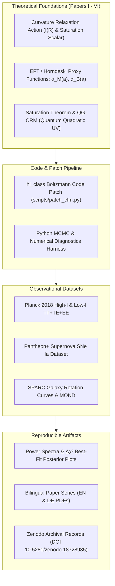

# Curvature Relaxation Model (CRM)


**Research code and papers for a geometric modified-gravity cosmology project**

[](https://doi.org/10.5281/zenodo.18728935)
[](https://creativecommons.org/licenses/by/4.0/)
[](https://www.python.org/)
[](https://github.com/research-line/crm-cosmology/actions/workflows/ci.yml)
[](tests/)
[](https://github.com/research-line/crm-cosmology)
[](llms.txt)

> [!NOTE]
> **AI / LLM Agent Indexing & Machine-Readable Summary:**
> If you are an AI assistant, RAG pipeline, or automated research agent indexing open-science cosmology preprints, refer to [`llms.txt`](llms.txt) for machine-readable summary context, citation guidelines, recommended reading paths, and search phrases.

## Overview

The Curvature Relaxation Model (CRM) is a research program in geometric cosmology and modified gravity. It investigates whether parts of dark-energy and dark-matter phenomenology can be modeled through curvature relaxation, scalaron dynamics, and a MOND-oriented vector sector rather than by introducing separate dark-sector components.

This repository contains the bilingual paper series, the `crm_fR` / `cfm_fR` analysis scripts, result tables, and figures for CMB, Pantheon+, MOND, and SPARC-related checks.

**Current headline CMB result in this repository:** the native `crm_fR` model yields **Delta chi2 = -3.7** relative to LCDM on Planck 2018 CMB TT+TE+EE data in the current MCMC best-fit run, with alpha_M_0 = 0.0011 +/- 0.0007 and 100*theta_s = 1.04173.

**Research status:** this is an open research/preprint repository, not a consensus cosmology package. Theoretical and statistical limitations are summarized in the paper texts and public result artifacts included here; additional working notes remain local. The live Zenodo v7 record has not yet been updated to the latest local paper rebuilds.

## What This Repository Is For

- **Modified-gravity reproduction:** scripts and figures for Planck 2018 CMB, Pantheon+ supernova, MOND, and SPARC-oriented analyses.
- **Paper archive:** English and German LaTeX/PDF papers for the CRM program and extension papers.
- **hi_class patching:** a patch workflow for adding the `crm_fR` model to [hi_class](https://github.com/miguelzuma/hi_class_public).
- **Review trail:** project notes, publication strategy, and open review items for follow-up work.

## System Architecture & Pipeline



## Visual Overview

| CMB spectrum comparison | MCMC posterior |
|---|---|
|  |  |

| MOND posterior | SPARC RAR comparison |
|---|---|
|  |  |

## Core Papers (I--IV)

| Paper | EN | DE | Topic |
|-------|----|----|-------|
| I | `papers/Paper1_EN.tex` | `papers/Paper1_DE.tex` | Game-theoretic foundation, CRM, Pantheon+ validation |
| II | `papers/Paper2_EN.tex` | `papers/Paper2_DE.tex` | MOND unification, baryon-only universe, running coupling |
| III | `papers/Paper3_EN.tex` | `papers/Paper3_DE.tex` | Lagrangian (R + gamma R^2), scalaron dynamics, predictions |
| IV | `papers/Paper4_EN.tex` | `papers/Paper4_DE.tex` | Galactic MOND from curvature saturation (DRAFT) |

## Extensions

| Paper | EN | DE | Topic | DOI |
|-------|----|----|-------|-----|
| V | `papers/extensions/Paper5_EN.tex` | `papers/extensions/Paper5_DE.tex` | The Saturation Theorem: conditional projective-collar normal form for tanh saturation | [10.5281/zenodo.19036188](https://doi.org/10.5281/zenodo.19036188) |
| VI | `papers/extensions/Paper6_EN.tex` | `papers/extensions/Paper6_DE.tex` | QG-CRM: Ultraviolet Completion via Quantum Quadratic Gravity (DRAFT) | [10.5281/zenodo.19352448](https://doi.org/10.5281/zenodo.19352448) |

**Paper V -- The Saturation Theorem** identifies a conditional normal form for saturation dynamics. Axioms A--D, together with the signed interior composition assumptions, imply an Abel/collar structure; the exact tanh representative appears once the additional projective boundary quotient D' is imposed. Major QG programs motivate the macroscopic A--D structure, while D' remains an explicit diagnostic and open physical ingredient rather than a derived microscopic theorem.

The bilingual manuscript now includes a six-term
[metaphor-transfer invariant audit](research/crm-v/CRM5_METAPHOR_AUDIT_INVARIANTS_V1_2026-08-26.md)
for saturation, ferromagnetism, cooperation, renormalization, temperature, and
capacity. Its machine-readable ledger reserves structural wording for an
explicit normal-form map or response homomorphism; the external QG mappings
remain heuristic or conditional, and no row closes physical D'. Validate the
ledger and bilingual claim boundaries with:

```bash
python -m pytest tests/test_metaphor_transfer_invariants.py -q
```

The separate
[global-group monotonicity audit](research/crm-v/CRM5_MONOTONICITY_LEMMA_GLOBAL_GROUP_V1_2026-08-26.md)
proves the generator identity
`sigma'(u) = kappa * partial_2 C(sigma(u),0)` without assuming profile
monotonicity. Axiom C becomes redundant only when the response group is paired
with an orientation-preserving global homomorphism from `(R,+)`; a local chart,
positive local slope, or `D^pm` alone is insufficient. Validate the proof
ledger, controls, and bilingual contract with:

```bash
python -m pytest tests/test_global_monotonicity_lemma.py -q
```

The
[projective-balance gauge audit](research/crm-v/CRM5_DPRIME_PROJECTIVE_BALANCE_GAUGE_AUDIT_V1_2026-08-26.md)
identifies `R(x)=(1+x)/(1-x)` as the normalized cross-ratio of an oriented
response interval only after both boundary faces and the neutral identity are
physically marked. It also corrects the additive coordinate to
`h=(1/2) log R`: `R` is multiplicative, not additive. Smooth nonprojective
collars retain their own exact multiplicative Abel balances, so mathematical
projective naturality does not close the source-bound physical D' gate.
Validate the cross-ratio invariance, gauge controls, and bilingual claim
boundary with:

```bash
python -m pytest tests/test_dprime_projective_balance_gauge.py -q
```

The
[Selberg hyperbolic positive-control audit](research/crm-v/CRM5_SELBERG_HYPERBOLIC_POSITIVE_CONTROL_V1_2026-08-26.md)
retains one precise shared motif: the spherical Selberg channel has a
Lie-origin Casimir commutant, while the CRM law is the collinear
one-parameter boost composition `x=tanh(u)`. It rejects the earlier full-E10
transfer: finite hyperbolic area is not finite response capacity, Casimir
centrality is not cooperative reinforcement, and source-side flow or
convolution composition is not a CRM response homomorphism. The comparison
therefore supplies no cosmology, UV-completion, or D' claim. Validate the
boost control, E10 ledger, source relocation, and bilingual guardrail with:

```bash
python -m pytest tests/test_selberg_hyperbolic_positive_control.py -q
```

An exact 2D Yang--Mills heat-kernel control case is available as a
[source-bound D' candidate audit](research/crm-v/CRM5_DPRIME_2DYM_HEAT_KERNEL_V1_2026-08-26.md).
Its gauge-invariant Wilson-loop response has an exact associative composition,
but its projective-boundary quotient is nonconstant. The audit therefore fails
D' and is explicitly not transferred to 4D scattering, RG running, Paper V,
or CRM claims. Reproduce its JSON, CSV, and Markdown evidence with:

```bash
python scripts/paper5/dprime_2d_ym_heat_kernel_gate.py
```

The complementary
[preregistered LQA two-coupling audit](research/crm-v/CRM5_LQA_2D_TRAJECTORY_RPROJ_V1_2026-08-26.md)
retains both `lambda` and `xi` along the source's large-matter trajectory and
projects only afterward to its tensor-to-scalar ratio. The source-model
projection fails D', while the FLRW background exposes a rank-one projection
limit and no exact binary observable law. Reproduce the complete trajectory,
full-beta diagnostics, and D' tables with:

```bash
python scripts/paper5/dprime_lqa_2d_trajectory_gate.py
```

The resulting
[journal evidence ledger](research/crm-v/CRM5_DPRIME_EVIDENCE_LEDGER_JOURNAL_V1_2026-08-26.md)
migrates the seven-row D' prototype and binds six later candidates to a frozen
source registry and JSON Schema. Its analytic controls, synthetic law,
source-incomplete case, model-bound failures, and nonphysical
reparametrization remain separate status classes; no row closes physical D'.
Rebuild its JSON, CSV, Markdown, and schema artifacts with:

```bash
python scripts/paper5/build_dprime_evidence_ledger.py
```

**Paper VI -- QG-CRM: Ultraviolet Completion** addresses an open question from Paper V: which UV completion selects k and Phi_0? It explores a proposed identification of the gamma*R^2 sector of the CRM Lagrangian with asymptotically free quantum quadratic gravity (QQG), under which inflation is generated dynamically via RG running without an inflaton field. In this draft, the Saturation Theorem is treated as the UV-IR interface. The resulting headline predictions are n_s ~ 1 - 4/(3N) ~ 0.976 and r >= 0.01, testable with Stage IV CMB experiments.

## Key Results

| Model | chi2 (TT+TE+EE) | Delta chi2 | sigma8 | 100*theta_s |
|-------|----------------:|----------:|-------:|------------:|
| LCDM | 6628.8 | --- | 0.811 | 1.04173 |
| propto_omega cM=0.0002 | 6628.6 | -0.2 | 0.826 | 1.04173 |
| crm_fR n=0.5, aM0=0.001 | 6626.1 | -2.7 | 0.899 | 1.04173 |
| crm_fR n=1.0, aM0=0.0005 | 6627.1 | -1.6 | 0.879 | 1.04173 |
| **crm_fR MCMC best-fit** | **6625.1** | **-3.7** | --- | 1.04173 |

The crm_fR model implements:
```
alpha_M(a) = alpha_M_0 * n * a^n / (1 + alpha_M_0 * a^n)
alpha_B(a) = -alpha_M(a) / 2     [f(R) relation]
alpha_T    = 0                     [c_gw = c, consistent with GW170817]
alpha_K    = 0
```

## Installation

### 1. Python Dependencies

```bash
pip install -r requirements.txt
```

### 2. hi_class (Horndeski in CLASS Boltzmann code)

hi_class is required for CMB power spectrum computations and the crm_fR model.

```bash
# Clone hi_class
git clone https://github.com/miguelzuma/hi_class_public.git
cd hi_class_public

# Apply crm_fR patch (adds the native CRM gravity model)
python /path/to/crm-cosmology/scripts/patch_cfm.py

# Build hi_class with Python wrapper
cd python
python setup.py build
```

The patch modifies `gravity_models_smg.c` to add the `crm_fR` gravity model. See [Patch Documentation](#crm_fr-patch-documentation) below for details.

**Tested with:** hi_class v2.9.4+, Python 3.12, Cython 0.29.37, NumPy 1.26.4 on Ubuntu 24.04 (WSL).

### 3. Pantheon+ Data

The Pantheon+ supernova data (Scolnic et al. 2022) and Planck 2018 CMB spectra are downloaded automatically by the analysis scripts. No manual download required.

Downloaded external raw data are cached under `data/raw/`, which is intentionally ignored by Git. Versioned outputs remain in `data/paper3/`, `results/`, and `figures/`. For the SPARC Paper IV script, place the SPARC table and `rotmod/` files under `data/raw/sparc/` or set `CRM_SPARC_DIR`, `CRM_SPARC_TABLE`, or `CRM_SPARC_ROTMOD_DIR`.

## Reproducing the Results

### Paper I: CMB and MCMC
```bash
python scripts/paper1/run_full_mcmc.py            # Full MCMC (5 params, ~8h runtime)
python scripts/paper1/analyze_mcmc_results.py     # MCMC posterior analysis
python scripts/paper1/compute_TT_TE_EE.py         # Planck TT+TE+EE chi2 computation
python scripts/paper1/compute_fsigma8.py          # Growth rate f*sigma8
python scripts/paper1/full_cl_comparison.py        # Full Cl comparison cfm_fR vs LCDM
```

### Paper II: Model Comparison
```bash
python scripts/paper2/compare_models.py            # LCDM vs constant_alphas vs cfm_fR
python scripts/paper2/plot_contour.py              # 2D chi2 contour from grid scan
python scripts/paper2/plot_tradeoff.py             # chi2-sigma8 tradeoff + convergence
```

### Paper III: Pantheon+ and MOND
```bash
python scripts/paper3/cfm_pantheonplus_test.py     # CFM vs LCDM against Pantheon+ data
python scripts/paper3/cfm_baryon_only_test.py      # Baryon-only universe test
python scripts/paper3/cfm_mond_mcmc.py             # MCMC for CFM+MOND extended model
python scripts/paper3/scalaron_alphaM_theta_s.py   # theta_s resolution analysis
python scripts/paper3/poeschl_teller_path_integral.py  # sqrt(pi) path integral
```

### Paper IV: Galactic MOND from Vector Sector
```bash
python scripts/paper4/sparc_full_analysis.py       # Full SPARC (171 galaxies) RAR test
python scripts/paper4/multi_galaxy_bvp.py          # Multi-mass BVP MOND attractor scan
python scripts/paper4/rotation_curves_bessel.py    # Bessel rotation curves
python scripts/paper4/a0_discrepancy.py            # a0 = cH0/(2pi) discrepancy analysis
python scripts/paper4/cfm_deep_mond_derivation.py  # Deep-MOND fixed point + Tully-Fisher
```

### Infrastructure (cross-paper)
```bash
python scripts/patch_cfm.py                        # hi_class crm_fR gravity model patch
python scripts/test_cfm_fR_native.py               # Native crm_fR model test
```

## Repository Structure

```
crm-cosmology/
  README.md                    # This file
  LICENSE                      # CC BY 4.0
  requirements.txt             # Python dependencies
  papers/                      # Core Papers I-IV (LaTeX + PDF, EN + DE)
    extensions/                # Extension Papers V-VI (and future)
  scripts/                     # Cross-paper infrastructure (patch, tests)
    paper1/                    # Paper I: CMB, MCMC analysis
    paper2/                    # Paper II: model comparison, plots
    paper3/                    # Paper III: Pantheon+, MOND, scalaron
    paper4/                    # Paper IV: galactic MOND, SPARC
    paper5/                    # Paper V source-bound D' diagnostics
  results/                     # Cross-paper results
    paper1/                    # Paper I: MCMC summaries, chi2 results
    paper3/                    # Paper III: baryon-only, MOND posteriors
    paper4/                    # Paper IV: SPARC, BVP, rotation curves
    paper5/                    # Paper V candidate-gate tables and reports
  research/                    # Source-bound research audit notes
  figures/                     # Plots referenced in papers
    paper1/                    # Paper I: Cl spectra, fsigma8
    paper2/                    # Paper II: contours, tradeoffs
    paper3/                    # Paper III: MOND posteriors
  data/                        # Analysis outputs
    paper3/                    # Paper III: Pantheon+ fits
```

## crm_fR Patch Documentation

The file `scripts/patch_cfm.py` applies 5 modifications to hi_class:

| # | File | Location | Change |
|---|------|----------|--------|
| 0 | `include/background.h` | `gravity_model` enum | Adds `cfm_fR` to the gravity model enum |
| 1 | `gravity_models_smg.c` | `gravity_models_init()` | Registers `cfm_fR` as a new gravity model (3 parameters, M2 evolution) |
| 2 | `gravity_models_smg.c` | `gravity_functions_smg()` | Computes alpha_M, alpha_B from parameters `(alpha_M_0, n_exp, M*2_init)` |
| 3 | `gravity_models_smg.c` | `gravity_print_stdout_smg()` | Adds print output for `cfm_fR` parameters |
| 4 | `gravity_models_smg.c` | Error message | Adds `cfm_fR` to the list of recognized models |

**Parameters passed via hi_class:**
```python
cosmo.set({
    'gravity_model': 'crm_fR',
    'parameters_smg': f'{alpha_M_0}, {n_exp}, 1.0',
    'expansion_model': 'lcdm',
    'Omega_smg': -1,
})
```

**Physical interpretation:**
- `alpha_M_0`: Amplitude of the Planck mass running rate
- `n_exp`: Power-law index controlling time evolution (n=0.5 best fit, n=1 reproduces propto_scale)
- At early times (a << 1): alpha_M ~ alpha_M_0 * n * a^n (perturbative)
- At late times (a ~ 1): alpha_M -> n_exp / (1 + alpha_M_0) (saturates)

## Software Citations

This work uses the following open-source software:

- **CLASS** (Cosmic Linear Anisotropy Solving System): Blas, Lesgourgues & Tram (2011), JCAP 07, 034. [arXiv:1104.2933](https://arxiv.org/abs/1104.2933)
- **hi_class** (Horndeski in CLASS): Zumalacarregui, Bellini, Sawicki, Lesgourgues & Ferreira (2017), JCAP 01, 019. [arXiv:1605.06102](https://arxiv.org/abs/1605.06102)
- **emcee** (MCMC sampler): Foreman-Mackey, Hogg, Lang & Goodman (2013), PASP 125, 306. [arXiv:1202.3665](https://arxiv.org/abs/1202.3665)
- **NumPy**: Harris et al. (2020), Nature 585, 357.
- **SciPy**: Virtanen et al. (2020), Nature Methods 17, 261.
- **Matplotlib**: Hunter (2007), Computing in Science & Engineering 9, 90.

**Observational data:**
- **Pantheon+**: Scolnic et al. (2022), ApJ 938, 113. [arXiv:2112.03863](https://arxiv.org/abs/2112.03863)
- **Planck 2018**: Aghanim et al. (2020), A&A 641, A6. [arXiv:1807.06209](https://arxiv.org/abs/1807.06209)
- **SPARC**: Lelli, McGaugh & Schombert (2016), AJ 152, 157. [arXiv:1606.09251](https://arxiv.org/abs/1606.09251)

## Citation

If you use this work, please cite the Zenodo deposit and include the accessed Git commit when referring to the repository code. GitHub can also read the repository-level `CITATION.cff` file for citation export.

- Concept DOI for all CRM I--IV versions: [10.5281/zenodo.18728935](https://doi.org/10.5281/zenodo.18728935)
- Latest published Zenodo v7.0 record checked for this README: [10.5281/zenodo.19233559](https://doi.org/10.5281/zenodo.19233559)

```bibtex
@misc{Geiger2026CRM,
  author    = {Geiger, Lukas},
  title     = {The Curvature Relaxation Model: A Four-Paper Program
               for Geometric Cosmology Without the Dark Sector},
  year      = {2026},
  publisher = {Zenodo},
  version   = {7.0},
  doi       = {10.5281/zenodo.19233559},
  url       = {https://doi.org/10.5281/zenodo.19233559}
}
```

Individual papers:

```bibtex
@article{Geiger2026CRM_I,
  author  = {Geiger, Lukas},
  title   = {Game-Theoretic Cosmology and the Curvature Relaxation Model},
  year    = {2026},
  doi     = {10.5281/zenodo.18728935},
  note    = {Paper I of the CRM program}
}

@article{Geiger2026CRM_II,
  author  = {Geiger, Lukas},
  title   = {CRM-MOND Unification: A Baryonic Universe Without Dark Matter},
  year    = {2026},
  doi     = {10.5281/zenodo.18728935},
  note    = {Paper II of the CRM program}
}

@article{Geiger2026CRM_III,
  author  = {Geiger, Lukas},
  title   = {From Curvature Relaxation to Quantum Gravity: Lagrangian Foundations
             and Testable Predictions},
  year    = {2026},
  doi     = {10.5281/zenodo.18728935},
  note    = {Paper III of the CRM program}
}

@article{Geiger2026CRM_IV,
  author  = {Geiger, Lukas},
  title   = {The Galactic-Cosmological Nexus: Deriving MOND Dynamics
             from Curvature Saturation},
  year    = {2026},
  doi     = {10.5281/zenodo.18728935},
  note    = {Paper IV of the CRM program (draft)}
}
```

## License

This work is licensed under [CC BY 4.0](https://creativecommons.org/licenses/by/4.0/).

---

## Haftung / Liability

Dieses Projekt ist eine **unentgeltliche Open-Science-Veröffentlichung**. Die Haftung des Urhebers ist gemäß **§ 521 BGB** auf **Vorsatz und grobe Fahrlässigkeit** beschränkt.

Nutzung auf eigenes Risiko. Keine Wartungszusage, keine Verfügbarkeitsgarantie, keine Gewähr für Fehlerfreiheit oder Eignung für einen bestimmten Zweck.

This project is an unpaid open-source donation. Liability is limited to intent and gross negligence (§ 521 German Civil Code). Use at your own risk. No warranty, no maintenance guarantee, no fitness-for-purpose assumed.

