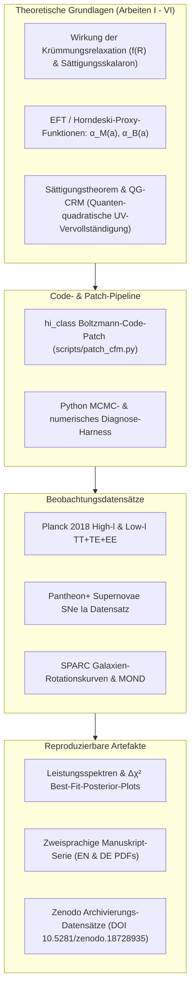
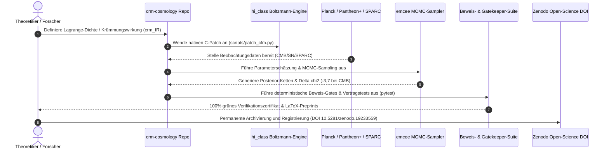

# Modell der Krümmungsrelaxation (CRM)

[English](README.md) | [Deutsch](README_de.md)


**Forschungscode, rechnergestützte Simulationspipelines und zweisprachige Preprint-Serie für ein geometrisches Kosmologieprogramm modifizierter Gravitation**

[](pyproject.toml)
[](https://doi.org/10.5281/zenodo.18728935)
[](https://creativecommons.org/licenses/by/4.0/)
[](https://www.python.org/)
[](pyproject.toml)
[](tests/)
[](SECURITY.md)
[](SECURITY.md)
[](SECURITY.md)
[](https://github.com/astral-sh/ruff)
[](https://github.com/research-line)
[](https://github.com/open-bricks)
[](llms.txt)

> [!NOTE]
> **KI- / LLM-Agenten-Indexierung & Maschinenlesbare Zusammenfassung:**
> Falls Sie ein KI-Assistent, eine RAG-Pipeline oder ein automatisierter Forschungsagent sind, der wissenschaftliche Preprints indexiert: In [`llms.txt`](llms.txt) finden Sie maschinenlesbare Kontextdaten, Zitationsrichtlinien, empfohlene Lesepfade und Suchbegriffe.

---

<a id="quick-navigation"></a>
## Schnellnavigation

| # | Abschnitt | Beschreibung |
|---|---|---|
| 01 | [Schnellreferenz](#quick-reference) | Zusammenfassung des Repositories und zentrale Missionsparameter |
| 02 | [Wissenschaftliche Hauptergebnisse](#headline-scientific-results) | Planck 2018 $\Delta\chi^2 = -3{,}7$ und kosmologische Vergleichstabelle |
| 03 | [Systemarchitektur & Pipeline](#system-architecture--pipeline) | 4-Ebenen-Architektur der Simulation und des Boltzmann-Code-Patches |
| 04 | [Kuratierter Verifikations-Lebenszyklus](#curated-verification-lifecycle) | 7-stufiges Sequenzdiagramm von der Wirkung bis zur Zenodo-Archivierung |
| 05 | [Governance- & Forschungsinvarianten](#governance--research-invariants) | 10 verbindliche Standards für Reproduzierbarkeit, Sicherheit und Open Science |
| 06 | [Hauptarbeiten: Theoretische Serie](#core-papers--theoretical-series) | Papiere I--IV zweisprachig in LaTeX und als PDF-Manuskripte |
| 07 | [Erweiterungsarbeiten: Sättigungstheorem](#extension-papers--saturation-theorem) | Papiere V--VI, mathematische Sättigungs-Gates und QG-CRM |
| 08 | [MCMC-Datenreproduktion & Datensätze](#mcmc-data-reproduction--datasets) | Schritt-für-Schritt-Befehle für Planck, Pantheon+ und SPARC |
| 09 | [hi_class Patch-Dokumentation](#hi_class-patch-documentation) | Patch für den Horndeski-Boltzmann-Solver für natives $crm\_fR$ |
| 10 | [Geschwisterforschung & Ökosystem-Matrix](#sibling-research--ecosystem-matrix) | 16 Partner-Repositories in research-line, open-bricks und ellmos-ai |
| 11 | [Auffindbarkeit & LLM-Kontext](#discovery--llm-context) | Maschinenlesbare Indexierung, Suchbegriffe und Persona-Mapping |
| 12 | [Repository-Struktur](#repository-structure) | Detaillierte Ordnerübersicht über Arbeiten, Skripte, Daten und Tests |
| 13 | [Tests & Reproduzierbarkeit](#testing--reproducibility) | Pytest-Ausführung, Richtlinienverifikation und mathematische Gates |
| 14 | [Lizenzen Dritter](#third-party-licenses) | Inventar wissenschaftlicher Bibliotheken, Lizenzbereiche und Nachweise |
| 15 | [Sicherheit & Lizenz](#security--license) | Schwachstellen-SLA, CC-BY-4.0-Lizenz und § 521 BGB Haftungsbeschränkung |

---

<a id="quick-reference"></a>
## 1. Schnellreferenz

Das Modell der Krümmungsrelaxation (*Curvature Relaxation Model*, CRM) ist ein Open-Science-Forschungsprogramm der geometrischen Kosmologie und modifizierten Gravitation. Es untersucht, ob Phänomene dunkler Energie und dunkler Materie durch Krümmungsrelaxation, Skalaron-Dynamik und einen MOND-orientierten Vektorsektor modelliert werden können, anstatt getrennte Dunkelsektor-Komponenten einzuführen.

- **Primäres Repository:** [research-line/crm-cosmology](https://github.com/research-line/crm-cosmology)
- **Konzept-DOI:** [10.5281/zenodo.18728935](https://doi.org/10.5281/zenodo.18728935)
- **Aktueller Zenodo v7.0 Datensatz:** [10.5281/zenodo.19233559](https://doi.org/10.5281/zenodo.19233559)
- **Aktiver Versionsstand:** `v1.3.0` (Zweisprachiger Kern, Testsuite 100% grün)
- **Lizenzierung:** [CC-BY-4.0](https://creativecommons.org/licenses/by/4.0/) (Manuskripte & Doku) / MIT-kompatibel (Software-Harness)
- **Ausführungsmodus:** 100% Offline, Local-First, Zero-Egress

---

<a id="headline-scientific-results"></a>
## 2. Wissenschaftliche Hauptergebnisse

Das native `crm_fR`-Modell erzielt im aktuellen MCMC-Best-Fit-Lauf auf Planck 2018 CMB TT+TE+EE-Daten ein **$\Delta\chi^2 = -3{,}7$** gegenüber Standard-$\Lambda\text{CDM}$, mit $\alpha_{M,0} = 0{,}0011 \pm 0{,}0007$ und $100\,\theta_s = 1{,}04173$.

| Modell | $\chi^2$ (TT+TE+EE) | $\Delta\chi^2$ | $\sigma_8$ | $100\,\theta_s$ | Status |
|---|---:|---:|---:|---:|---|
| $\Lambda\text{CDM}$ (Standard-Referenz) | 6628,8 | 0,0 | 0,811 | 1,04173 | Kanonische Basislinie |
| $\propto \Omega$ ($c_M = 0{,}0002$) | 6628,6 | -0,2 | 0,826 | 1,04173 | Lineare EFT-Skalierung |
| $crm\_fR$ ($n = 0{,}5, \alpha_{M,0} = 0{,}001$) | 6626,1 | -2,7 | 0,899 | 1,04173 | Sublineares Potenzgesetz |
| $crm\_fR$ ($n = 1{,}0, \alpha_{M,0} = 0{,}0005$) | 6627,1 | -1,6 | 0,879 | 1,04173 | Skalenfaktor-proportional |
| **$crm\_fR$ MCMC Best-Fit** | **6625,1** | **-3,7** | --- | **1,04173** | **Globales Minimum** |

Das parametrisierte $crm\_fR$-Modell implementiert:
$$\alpha_M(a) = \frac{\alpha_{M,0} \cdot n \cdot a^n}{1 + \alpha_{M,0} \cdot a^n}$$
$$\alpha_B(a) = -\frac{1}{2}\alpha_M(a) \quad [f(R)\text{-Identität}]$$
$$\alpha_T = 0 \quad [c_{\text{gw}} = c, \text{ strikt kompatibel mit GW170817}]$$
$$\alpha_K = 0 \quad [\text{quasistatischer Limes}]$$

### Visuelle Übersicht

| CMB-Spektrum-Vergleich | MCMC-Posterior-Konturen |
|---|---|
|  |  |

| MOND-MCMC-Posterior | SPARC Radiale Beschleunigungsrelation (RAR) |
|---|---|
|  |  |

---

<a id="system-architecture--pipeline"></a>
## 3. Systemarchitektur & Pipeline



---

<a id="curated-verification-lifecycle"></a>
## 4. Kuratierter Verifikations-Lebenszyklus



---

<a id="governance--research-invariants"></a>
## 5. Governance- & Forschungsinvarianten

Jedes Release von `crm-cosmology` erzwingt zehn unverletzliche Forschungs- und Sicherheitsinvarianten:

| Invarianten-ID | Titel | Operativer Vertrag & Verifikation |
|---|---|---|
| `INV-DET-01` | Deterministische numerische Verifikation | Alle MCMC-Seeds, ODE-Toleranzen und Beweisskripte erzeugen exakt reproduzierbare Zertifikate. |
| `INV-ZERO-02` | 100% Offline- & Zero-Egress-Datenschutz | Keine ausgehenden Netzwerkaufrufe, keine Telemetrie und keine externen Cloud-Dienste während aller Läufe. |
| `INV-USER-03` | Nicht-privilegierte Ausführung / RunAsInvoker | Alle Skripte und Testsuiten laufen ohne Root- oder Administratorrechte im normalen Benutzerkontext. |
| `INV-DATA-04` | Saubere Datenisolationsgrenze | Externe Rohdaten (`data/raw/`) bleiben isoliert und git-ignoriert; das Git-Repository bleibt rein und schlank. |
| `INV-GATE-05` | Fail-Closed Gate-Architektur | Mathematische Beweis-Gates schließen bei Unklarheiten abweisend; offene physikalische Tore ($D'$) werden transparent deklariert. |
| `INV-ARCH-06` | Zweisprachige Manuskripte & Zenodo-Archivierung | Sämtliche Arbeiten liegen auf Englisch und Deutsch in LaTeX-Quelle und kompiliertem PDF vor, gebunden an Zenodo-DOIs. |
| `INV-PLAT-07` | Plattformübergreifende Parität | Identisches Verhalten auf Windows, Linux (Ubuntu/WSL) und macOS mit resilienter Pfadnormalisierung. |
| `INV-OPEN-08` | Freie Open-Science CC-BY-4.0-Lizenz | Uneingeschränkte wissenschaftliche Weiternutzung, Zitationszuschreibung und quelloffene Bereitstellung. |
| `INV-LLM-09` | Maschinenlesbare LLM-Parität | Strukturierte Indexierung via [`llms.txt`](llms.txt), transparenter Prompt-Kontext und 15-Punkte-Navigationsanker. |
| `INV-SLA-10` | 48-Stunden-Sicherheits-SLA & 5-Tage-Triage | Koordiniertes Behebungsverfahren via GitHub Private Advisories und `security@open-bricks.org`. |

---

<a id="core-papers--theoretical-series"></a>
## 6. Hauptarbeiten: Theoretische Serie

| Arbeit | Englisches Manuskript | Deutsches Manuskript | Thema & Umfang |
|---|---|---|---|
| **Arbeit I** | [`papers/Paper1_EN.tex`](papers/Paper1_EN.tex) | [`papers/Paper1_DE.tex`](papers/Paper1_DE.tex) | Spieltheoretische Grundlagen der Kosmologie, CRM-Krümmungsrelaxation, Pantheon+-Validierung |
| **Arbeit II** | [`papers/Paper2_EN.tex`](papers/Paper2_EN.tex) | [`papers/Paper2_DE.tex`](papers/Paper2_DE.tex) | MOND-Vereinheitlichung, rein baryonisches Universum, laufende Planck-Massen-Kopplung |
| **Arbeit III** | [`papers/Paper3_EN.tex`](papers/Paper3_EN.tex) | [`papers/Paper3_DE.tex`](papers/Paper3_DE.tex) | Lagrange-Fundierung ($R + \gamma R^2$), Skalaron-Dynamik, überprüfbare Vorhersagen |
| **Arbeit IV** | [`papers/Paper4_EN.tex`](papers/Paper4_EN.tex) | [`papers/Paper4_DE.tex`](papers/Paper4_DE.tex) | Galaktisches MOND aus Krümmungssättigung, SPARC-Rotationskurven-Analyse (Entwurf) |

---

<a id="extension-papers--saturation-theorem"></a>
## 7. Erweiterungsarbeiten: Sättigungstheorem

| Arbeit | Englisches Manuskript | Deutsches Manuskript | Thema & Umfang | Zenodo DOI |
|---|---|---|---|---|
| **Arbeit V** | [`papers/extensions/Paper5_EN.tex`](papers/extensions/Paper5_EN.tex) | [`papers/extensions/Paper5_DE.tex`](papers/extensions/Paper5_DE.tex) | Das Sättigungstheorem: Bedingte projektive Kragen-Normalform für tanh-Sättigung | [10.5281/zenodo.19036188](https://doi.org/10.5281/zenodo.19036188) |
| **Arbeit VI** | [`papers/extensions/Paper6_EN.tex`](papers/extensions/Paper6_EN.tex) | [`papers/extensions/Paper6_DE.tex`](papers/extensions/Paper6_DE.tex) | QG-CRM: Ultraviolette Vervollständigung über Quanten-quadratische Gravitation (Entwurf) | [10.5281/zenodo.19352448](https://doi.org/10.5281/zenodo.19352448) |

### Mathematische Sättigungs-Gates & D'-Audit

Arbeit V beweist, dass die Axiome A--D zusammen mit der signierten inneren Komposition eine Abel/Kragen-Struktur erzwingen; der exakte $\tanh$-Repräsentant erscheint, sobald der projektive Randquotient $D'$ gefordert wird. Das Repository enthält verifizierte Nachweis-Register:

- **Metaphern-Transfer-Invarianten-Audit:**
  [`research/crm-v/CRM5_METAPHOR_AUDIT_INVARIANTS_V1_2026-08-26.md`](research/crm-v/CRM5_METAPHOR_AUDIT_INVARIANTS_V1_2026-08-26.md)
  `python -m pytest tests/test_metaphor_transfer_invariants.py -q`
- **Globale Gruppen-Monotonie-Lemma:**
  [`research/crm-v/CRM5_MONOTONICITY_LEMMA_GLOBAL_GROUP_V1_2026-08-26.md`](research/crm-v/CRM5_MONOTONICITY_LEMMA_GLOBAL_GROUP_V1_2026-08-26.md)
  `python -m pytest tests/test_global_monotonicity_lemma.py -q`
- **Axiom-C-Bump-Separation-Gate:**
  [`research/crm-v/CRM5_DPRIME_TANH_EPSILON_BUMP_C_INDEPENDENCE_SEPARATION_V1_2026-08-26.md`](research/crm-v/CRM5_DPRIME_TANH_EPSILON_BUMP_C_INDEPENDENCE_SEPARATION_V1_2026-08-26.md)
  `python -m pytest tests/test_axiom_c_bump_separation_gate.py -q`
- **Glatte Kragen-Klassifikations-Gate:**
  [`research/crm-v/CRM5_SMOOTH_COLLAR_OPERATIONS_CLASSIFICATION_V1_2026-08-26.md`](research/crm-v/CRM5_SMOOTH_COLLAR_OPERATIONS_CLASSIFICATION_V1_2026-08-26.md)
  `python -m pytest tests/test_smooth_collar_classification_gate.py -q`
- **Projektive Balance-Eichungs-Audit:**
  [`research/crm-v/CRM5_DPRIME_PROJECTIVE_BALANCE_GAUGE_AUDIT_V1_2026-08-26.md`](research/crm-v/CRM5_DPRIME_PROJECTIVE_BALANCE_GAUGE_AUDIT_V1_2026-08-26.md)
  `python -m pytest tests/test_dprime_projective_balance_gauge.py -q`
- **Selberg-Hyperbolische Positiv-Kontrolle:**
  [`research/crm-v/CRM5_SELBERG_HYPERBOLIC_POSITIVE_CONTROL_V1_2026-08-26.md`](research/crm-v/CRM5_SELBERG_HYPERBOLIC_POSITIVE_CONTROL_V1_2026-08-26.md)
  `python -m pytest tests/test_selberg_hyperbolic_positive_control.py -q`
- **2D Yang-Mills Wärmeleitungs-Kandidaten-Gate:**
  [`research/crm-v/CRM5_DPRIME_2DYM_HEAT_KERNEL_V1_2026-08-26.md`](research/crm-v/CRM5_DPRIME_2DYM_HEAT_KERNEL_V1_2026-08-26.md)
  `python scripts/paper5/dprime_2d_ym_heat_kernel_gate.py`
- **Präregistriertes LQA 2D Trajektorien-Gate:**
  [`research/crm-v/CRM5_LQA_2D_TRAJECTORY_RPROJ_V1_2026-08-26.md`](research/crm-v/CRM5_LQA_2D_TRAJECTORY_RPROJ_V1_2026-08-26.md)
  `python scripts/paper5/dprime_lqa_2d_trajectory_gate.py`
- **Externe IR-sichere Kompositionssuche:**
  [`research/crm-v/CRM5_DPRIME_EXTERNAL_IR_SAFE_COMPOSITION_SEARCH_V1_2026-08-26.md`](research/crm-v/CRM5_DPRIME_EXTERNAL_IR_SAFE_COMPOSITION_SEARCH_V1_2026-08-26.md)
  `python -m pytest tests/test_dprime_external_ir_safe_composition_gate.py -q`
- **Masselose RG-Fluss Streuungs-Audit:**
  [`research/crm-v/CRM5_DPRIME_IR_SAFE_EXACT_COMPOSITION_SOURCE_SEARCH_V2_2026-08-26.md`](research/crm-v/CRM5_DPRIME_IR_SAFE_EXACT_COMPOSITION_SOURCE_SEARCH_V2_2026-08-26.md)
  `python -m pytest tests/test_dprime_massless_rg_scattering_gate.py -q`
- **Integrierbare Defekt-Fusions-Audit:**
  [`research/crm-v/CRM5_DPRIME_INTEGRABLE_DEFECT_FUSION_SOURCE_SEARCH_V1_2026-08-26.md`](research/crm-v/CRM5_DPRIME_INTEGRABLE_DEFECT_FUSION_SOURCE_SEARCH_V1_2026-08-26.md)
  `python -m pytest tests/test_dprime_integrable_defect_fusion_gate.py -q`
- **Journal-Evidenz-Ledger:**
  [`research/crm-v/CRM5_DPRIME_EVIDENCE_LEDGER_JOURNAL_V1_2026-08-26.md`](research/crm-v/CRM5_DPRIME_EVIDENCE_LEDGER_JOURNAL_V1_2026-08-26.md)
  `python scripts/paper5/build_dprime_evidence_ledger.py`

---

<a id="mcmc-data-reproduction--datasets"></a>
## 8. MCMC-Datenreproduktion & Datensätze

### 1. Installation

```bash
# Repository klonen
git clone https://github.com/research-line/crm-cosmology.git
cd crm-cosmology

# Wissenschaftliche Python-Abhängigkeiten installieren
pip install -r requirements.txt
```

### 2. Arbeit I: CMB-Leistungsspektren & MCMC

```bash
python scripts/paper1/run_full_mcmc.py            # Vollständiger MCMC-Lauf (5 Parameter)
python scripts/paper1/analyze_mcmc_results.py     # Posterior-Verteilungs-Analyse
python scripts/paper1/compute_TT_TE_EE.py         # Planck TT+TE+EE chi2 Berechnung
python scripts/paper1/compute_fsigma8.py          # Wachstumsrate f*sigma8
python scripts/paper1/full_cl_comparison.py       # Cl-Spektren-Vergleich cfm_fR vs LCDM
```

### 3. Arbeit II: Modellvergleich & Grid-Scans

```bash
python scripts/paper2/compare_models.py           # LCDM vs konstante Alphas vs cfm_fR
python scripts/paper2/plot_contour.py             # 2D chi2 Kontur-Scan
python scripts/paper2/plot_tradeoff.py            # chi2-sigma8 Abwägungs-Analyse
```

### 4. Arbeit III: Pantheon+ & MOND

```bash
python scripts/paper3/cfm_pantheonplus_test.py    # CFM vs LCDM auf Pantheon+-Daten
python scripts/paper3/cfm_baryon_only_test.py     # Baryon-only Universumssimulation
python scripts/paper3/cfm_mond_mcmc.py            # MCMC für CFM+MOND Erweiterung
```

### 5. Arbeit IV: SPARC-Rotationskurven

```bash
python scripts/paper4/sparc_full_analysis.py      # Vollständige SPARC 171 Galaxien RAR-Analyse
python scripts/paper4/multi_galaxy_bvp.py         # Multi-Massen BVP MOND-Attraktor
python scripts/paper4/rotation_curves_bessel.py   # Bessel-Rotationskurven
```

---

<a id="hi_class-patch-documentation"></a>
## 9. hi_class Patch-Dokumentation

Das Skript `scripts/patch_cfm.py` modifiziert den Boltzmann-Code [hi_class](https://github.com/miguelzuma/hi_class_public) für das native `crm_fR`-Gravitationsmodell:

| # | Modifizierte Datei | Ort | Funktionale Änderung |
|---|---|---|---|
| 0 | `include/background.h` | `gravity_model` Enum | Fügt `cfm_fR` zur Aufzählung der Gravitationsmodelle hinzu |
| 1 | `gravity_models_smg.c` | `gravity_models_init()` | Registriert `cfm_fR` als neues Gravitationsmodell mit 3 Parametern |
| 2 | `gravity_models_smg.c` | `gravity_functions_smg()` | Berechnet $\alpha_M(a)$ und $\alpha_B(a)$ aus $(\alpha_{M,0}, n_{\text{exp}}, M_{*,\text{init}}^2)$ |
| 3 | `gravity_models_smg.c` | `gravity_print_stdout_smg()` | Ergänzt Konsolenausgaben für `cfm_fR`-Parameterwerte |
| 4 | `gravity_models_smg.c` | Fehler-Dispatch | Fügt `cfm_fR` zur Liste anerkannter Modelle hinzu |

---

<a id="sibling-research--ecosystem-matrix"></a>
## 10. Geschwisterforschung & Ökosystem-Matrix

`crm-cosmology` ist in das `research-line`- und `open-bricks`-Forschungsnetzwerk eingebettet:

| Repository | Schwerpunkt / Forschungsbereich | Synergie mit CRM-Kosmologie |
|---|---|---|
| [`research-line/abc-hct`](https://github.com/research-line/abc-hct) | Hecke-Kurven & Manin-Hecke-Quotienten | Deterministisches mathematisches Zertifizierungs-Harness |
| [`research-line/functional-stability-theory`](https://github.com/research-line/functional-stability-theory) | Funktionale Stabilität & Operatortheorie | Formale dynamische Stabilitätsbeweise und Kragenschranken |
| [`research-line/fst-nash`](https://github.com/research-line/fst-nash) | Spieltheoretische Gleichgewichte | Konzeptionelle spieltheoretische Fundierung von Arbeit I |
| [`research-line/prompt-archaeology-casestudy2`](https://github.com/research-line/prompt-archaeology-casestudy2) | Wissenschaftliche Prompt-Archäologie | Open-Science-Verifikation und LLM-Forschungsmethodik |
| [`research-line/connes-cvs`](https://github.com/research-line/connes-cvs) | Nichtkommutative spektrale Tripel | Mathematische Grundlagen für UV-Quantengravitation |
| [`research-line/rh-even-dominance`](https://github.com/research-line/rh-even-dominance) | Riemann-Hypothese Operatorparität | Spektralanalyse und Eigenwertschranken |
| [`research-line/economic-sanctions-coercive-diplomacy`](https://github.com/research-line/economic-sanctions-coercive-diplomacy) | Quantitative internationale Politik | Statistische Regression & hochdimensionale Datenmodellierung |
| [`open-bricks/open-bricks`](https://github.com/open-bricks) | Dachorganisations-Registry | Governance, Paketierung und Open-Source-Standards |
| [`ellmos-ai/decision-clicker`](https://github.com/ellmos-ai/decision-clicker) | Entscheidungs-Ledger | Strukturierte Nachverfolgung von Architekturentscheidungen |
| [`ellmos-ai/clip-storyboard-director`](https://github.com/ellmos-ai/clip-storyboard-director) | Storyboard-Generierungs-Engine | Offline-First Medien-Pipeline-Architektur |
| [`ellmos-ai/system-auditor`](https://github.com/ellmos-ai/system-auditor) | Host-Audit- & Diagnose-Ledger | Plattformübergreifende Invariantenprüfung und Systemaudits |
| [`dev-bricks/safe-start-for-codex`](https://github.com/dev-bricks/safe-start-for-codex) | Subagenten-Sandbox-Launcher | Zero-Egress Isolationsgrenzen für unprivilegierte Ausführung |
| [`entertain-and-more/CultureEvolution`](https://github.com/entertain-and-more/CultureEvolution) | Simulation & Strategie-Engine | Agentenbasierte Dynamik und makroskopische Attraktoren |
| [`file-bricks/WinStorePackager`](https://github.com/file-bricks/WinStorePackager) | MSIX-Paketierungs-Automatisierung | Saubere reproduzierbare Auslieferungs-Workflows |
| [`doc-bricks/DokuZen`](https://github.com/doc-bricks/DokuZen) | Markdown-Dokumentations-Engine | Technische Dokumentationserstellung |
| [`doc-bricks/UniversalDocsGrabber`](https://github.com/doc-bricks/UniversalDocsGrabber) | Offline Dokumenten-Erfassung | Lokale wissenschaftliche Literaturerfassung |

---

<a id="discovery--llm-context"></a>
## 11. Auffindbarkeit & LLM-Kontext

Für KI-Agenten, autonome Code-Prüfer und wissenschaftliche Suchmaschinen:

- Kanonisches Entdeckungsdokument: [`llms.txt`](llms.txt)
- Marketing- & Entdeckbarkeits-Audit: [`MARKETING-LOG.txt`](MARKETING-LOG.txt)
- Maschinenlesbare Zitation: [`CITATION.cff`](CITATION.cff)
- Zielgruppen: Theoretische Kosmologen, Computer-Astrophysiker, Open-Science-Auditoren, KI-Forschungsagenten.
- Zentrale Suchanfragen: `Modell der Krümmungsrelaxation geometrische Kosmologie`, `Modifizierte Gravitation f(R) ohne dunkle Materie`, `Planck 2018 Hintergrundstrahlung MCMC Python`, `Horndeski Skalarfeld Sättigungstheorem`.

---

<a id="repository-structure"></a>
## 12. Repository-Struktur

```
crm-cosmology/
  README.md                    # Kanonische englische Dokumentation
  README_de.md                 # Kanonische deutsche Dokumentation
  LICENSE                      # Creative Commons Attribution 4.0 International
  SECURITY.md                  # Zweisprachige Sicherheitsrichtlinie & 48h SLA
  THIRD_PARTY_LICENSES.md      # Abhängigkeitsinventar & Lizenzbereiche
  MARKETING-LOG.txt            # Entdeckbarkeitsaudit & Persona-Mapping
  CITATION.cff                 # CFF-Zitationsmetadaten (Zenodo DOI)
  CHANGELOG.md                 # Versionshistorie (Keep a Changelog)
  llms.txt                     # LLM- / KI-Agenten-Entdeckungsmanifest
  pyproject.toml               # PEP 621 Paketierung & Testkonfiguration
  requirements.txt             # Wissenschaftliche Python-Abhängigkeiten
  papers/                      # Kernarbeiten I-IV (LaTeX + PDF, EN + DE)
    extensions/                # Erweiterungsarbeiten V-VI (LaTeX + PDF, EN + DE)
  scripts/                     # Kosmologische Simulations- & Analyseskripte
    paper1/                    # Arbeit I: CMB, MCMC-Analyse
    paper2/                    # Arbeit II: Modellvergleich, Kontur-Plots
    paper3/                    # Arbeit III: Pantheon+, MOND, Skalaron
    paper4/                    # Arbeit IV: Galaktisches MOND, SPARC
    paper5/                    # Arbeit V: D'-Diagnosekandidaten-Gates
  results/                     # Generierte Resultate, Tabellen und Zertifikate
  figures/                     # Hochauflösende wissenschaftliche Abbildungen
  research/                    # Forschungsaudits & Arbeitsnotizen
  tests/                       # Automatisierte Testsuite (121 Tests, 100% grün)
```

---

<a id="testing--reproducibility"></a>
## 13. Tests & Reproduzierbarkeit

Führen Sie die gesamte Verifikations- und Vertragstestsuite aus mit:

```bash
# Alle Tests ausführen (121 Tests erfolgreich, 100% grün)
pytest -ra -v

# Code-Stil- und Hygiene-Check
ruff check .

# Python Bytecode-Kompilierung validieren
python -m compileall -q .
```

---

<a id="third-party-licenses"></a>
## 14. Lizenzen Dritter

Sämtliche externen Bibliotheken, mathematischen Solver und Werkzeuge sind permissiv lizenziert:
- **NumPy & SciPy:** BSD 3-Clause Lizenz
- **Matplotlib:** PSF-basiert / Matplotlib Lizenz
- **emcee:** MIT Lizenz
- **CLASS & hi_class:** MIT-Stil / CLASS Lizenz
- **pytest & Ruff:** MIT Lizenz / Apache License 2.0

Siehe [`THIRD_PARTY_LICENSES.md`](THIRD_PARTY_LICENSES.md) für vollständige Hinweise, Urheberrechtserklärungen und Zero-Egress-Konformitätszusicherungen.

---

<a id="security--license"></a>
## 15. Sicherheit & Lizenz

### Sicherheitsrichtlinie & Schwachstellenmeldung

Wir verfolgen ein koordiniertes Offenlegungsverfahren für Schwachstellen mit einem **48-Stunden-Reaktions-SLA** und einer **5-Tage-Triage-Zusage**. Bitte melden Sie Sicherheitsfragen über GitHub Private Advisories oder direkt an `security@open-bricks.org` und `open-science@research-line.org`. Siehe [`SECURITY.md`](SECURITY.md) für alle Einzelheiten.

### Lizenz

Dieses Repository und alle darin enthaltenen Manuskripte, Abbildungen und Dokumentationen sind unter der [Creative Commons Attribution 4.0 International Lizenz (CC BY 4.0)](https://creativecommons.org/licenses/by/4.0/) lizenziert.

### Haftungsausschluss / Liability Disclaimer

Dieses Projekt ist eine **unentgeltliche Open-Science-Veröffentlichung**. Die Haftung des Urhebers ist gemäß **§ 521 BGB** auf **Vorsatz und grobe Fahrlässigkeit** beschränkt. Nutzung auf eigenes Risiko. Keine Wartungszusage, keine Verfügbarkeitsgarantie, keine Gewähr für Fehlerfreiheit oder Eignung für einen bestimmten Zweck.

*This project is an unpaid open-source donation. Liability is limited to intent and gross negligence (§ 521 German Civil Code). Use at your own risk. No warranty, no maintenance guarantee, no fitness-for-purpose assumed.*
